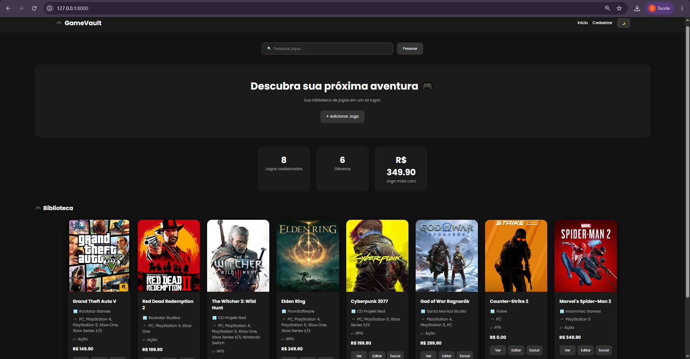
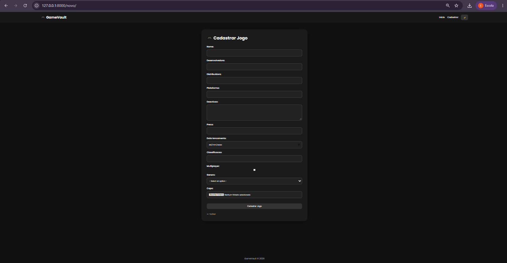
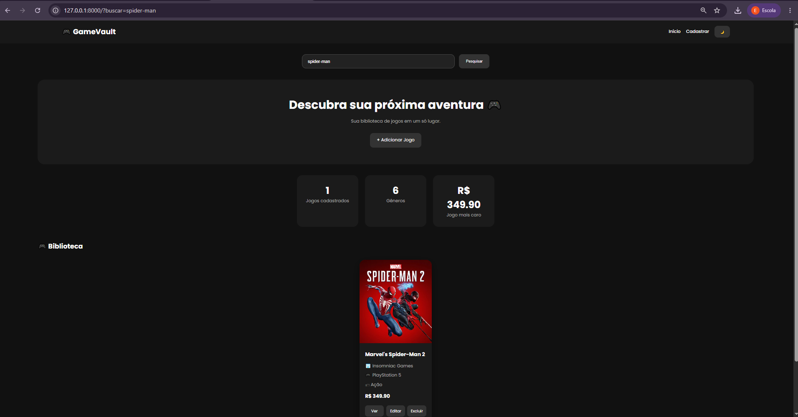
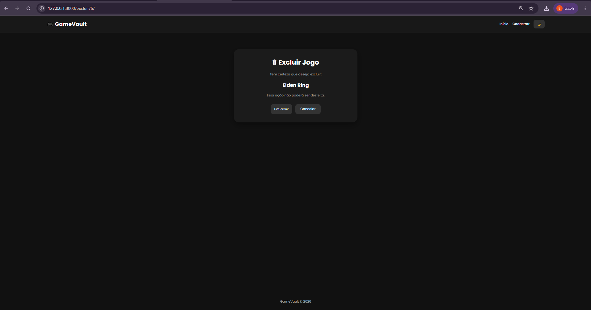
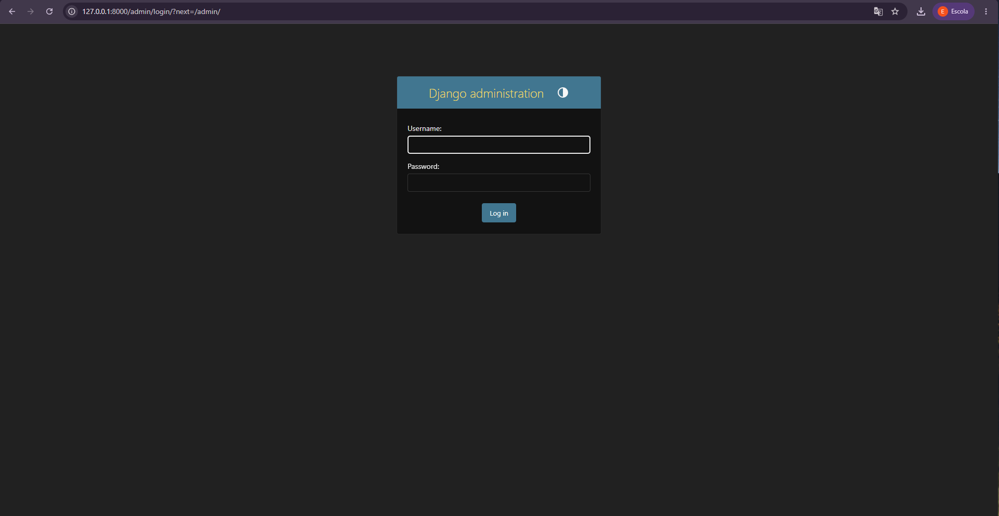

# 🎮 GameVault

## Sistema de Gerenciamento de Jogos

O **GameVault** é uma aplicação web desenvolvida em **Django** com o objetivo de gerenciar um catálogo de jogos digitais.

O sistema permite cadastrar, visualizar, editar e excluir jogos, além de possuir recursos adicionais como pesquisa, dashboard com estatísticas, upload de capas e interface moderna com modo claro e escuro.

---

# 🚀 Funcionalidades

## 🎮 Gerenciamento de Jogos (CRUD)

O sistema possui todas as operações básicas:

* ✅ Cadastro de jogos
* ✅ Visualização dos jogos cadastrados
* ✅ Edição de informações
* ✅ Exclusão com confirmação
* ✅ Página de detalhes do jogo

## 🖼️ Upload de Capas

Cada jogo pode possuir uma imagem de capa personalizada, tornando a visualização semelhante a uma biblioteca digital de jogos.

## 🔍 Pesquisa

Possui uma barra de pesquisa que permite encontrar jogos rapidamente pelo nome.

## 📊 Dashboard

O sistema apresenta informações gerais do catálogo:

* Quantidade de jogos cadastrados
* Quantidade de gêneros
* Jogo mais caro
* Estatísticas de plataformas

## 🌙 Tema Claro e Escuro

A interface possui alternância entre:

* Modo claro
* Modo escuro

proporcionando uma melhor experiência de navegação.

---

# 🛠️ Tecnologias Utilizadas

## Backend

* Python
* Django

## Banco de Dados

* SQLite

## Frontend

* HTML5
* CSS3
* Django Templates

## Outros recursos

* Django Admin
* Upload de imagens
* Sistema de mensagens
* ModelForms

---

# 📂 Estrutura do Projeto

```
GameVault
│
├── jogos
│   ├── models.py
│   ├── views.py
│   ├── forms.py
│   ├── urls.py
│   └── templates
│
├── gamevault
│   ├── settings.py
│   └── urls.py
│
├── media
│   └── capas
│
├── static
│   └── css
│
├── db.sqlite3
└── manage.py
```

---

# ⚙️ Como executar o projeto

## 1. Clone o repositório

```bash
git clone URL_DO_REPOSITORIO
```

---

## 2. Entre na pasta do projeto

```bash
cd GameVault
```

---

## 3. Crie um ambiente virtual

```bash
python -m venv venv
```

---

## 4. Ative o ambiente virtual

Windows:

```bash
venv\Scripts\activate
```

Linux/Mac:

```bash
source venv/bin/activate
```

---

## 5. Instale as dependências

```bash
pip install django pillow
```

---

## 6. Execute as migrations

```bash
python manage.py makemigrations

python manage.py migrate
```

---

## 7. Crie um usuário administrador

```bash
python manage.py createsuperuser
```

---

## 8. Execute o servidor

```bash
python manage.py runserver
```

Acesse:

```
http://127.0.0.1:8000/
```

Área administrativa:

```
http://127.0.0.1:8000/admin/
```

---

# 📸 Interface do Sistema

O GameVault possui:

* Página inicial com catálogo de jogos
* Cards com capas e informações
* Tela de cadastro
* Tela de edição
* Tela de detalhes
* Tela de exclusão
* Painel administrativo

---

# 🎯 Objetivo do Projeto

O projeto foi desenvolvido para aplicar conceitos de desenvolvimento **Backend com Django**, utilizando:

* Modelagem de dados
* Relacionamentos entre tabelas
* CRUD completo
* Templates Django
* Formulários
* Upload de arquivos
* Organização de aplicações web

---

# 📸 Demonstração do Sistema


## 🏠 Página Inicial

Tela principal do GameVault com catálogo de jogos, capas, estatísticas e navegação.

<p align="center">



</p>


---


## 🎮 Cadastro de Jogos

Tela de cadastro de novos jogos com informações completas e upload de capa.

<p align="center">



</p>


---


## 🔎 Pesquisa de Jogos

Sistema de busca para localizar jogos pelo nome.

<p align="center">



</p>


---


## 📄 Detalhes do Jogo

Página com todas as informações do jogo selecionado, incluindo capa, descrição e dados cadastrados.

<p align="center">


</p>


---


## 🗑️ Exclusão de Jogos

Tela de confirmação para remoção segura de jogos cadastrados.

<p align="center">



</p>


---


# 🔐 Área Administrativa Django


## Login Administrativo

Página de autenticação do painel administrativo do Django.

<p align="center">



</p>


---


## Painel Administrativo

Dashboard administrativo utilizado para gerenciar jogos e gêneros cadastrados.

<p align="center">


</p>

# 👨‍💻 Desenvolvedor

**Vitor Silva**

Projeto acadêmico desenvolvido para a disciplina de Backend utilizando Python e Django.

---

# 📌 Versão

**GameVault v1.0**

Desenvolvido em 2026 🎮
